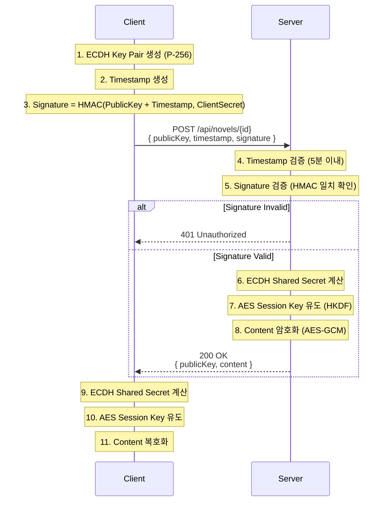

# 암호화 명세서 (v4 - ECDH + Client Auth)

## 프로토콜 개요
**ECDH (P-256)** 키 교환에 **HMAC-SHA256 서명**을 추가하여 클라이언트 인증을 수행합니다.

### 1. 키 교환 핸드셰이크 (Key Exchange Handshake)
1.  **Client (클라이언트)**:
    *   ECDH 키 쌍 생성 (`Client Public Key`).
    *   현재 시간 `timestamp` (Unix Epoch Milliseconds) 생성.
    *   **서명 생성**: `Signature` = HMAC-SHA256(`Client Public Key` + `timestamp`, `CLIENT_SECRET`).
    *   전송: `{ publicKey, timestamp, signature }`

2.  **Server (서버)**:
    *   **타임스탬프 검증**: `Current Time` - `timestamp` < 5분 (Replay Attack 방지).
    *   **서명 검증**: 서버가 가진 `CLIENT_SECRET`으로 동일하게 HMAC을 계산하여 `signature`와 비교.
    *   검증 성공 시 ECDH 수행 (v3와 동일).
    *   응답: `{ publicKey, content }`

### 흐름도 (Sequence Diagram)

## 인증 정보 (Demo)
- **CLIENT_SECRET**: `auth-secret-1234`
- **Encryption Algorithm**: AES-256-GCM (Derived from ECDH)
