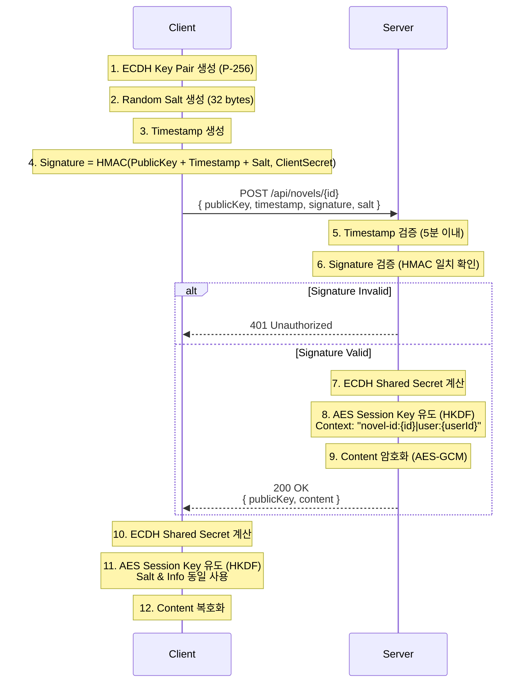

# 암호화 명세서 (v4 - ECDH + Client Auth)

## 프로토콜 개요
**ECDH (P-256)** 키 교환에 **HMAC-SHA256 서명**을 추가하여 클라이언트 인증을 수행합니다.

### 1. 키 교환 핸드셰이크 (Key Exchange Handshake)
1.  **Client (클라이언트)**:
    *   ECDH 키 쌍 생성 (`Client Public Key`).
    *   **Random Salt 생성**: 32 bytes 난수 (Base64).
    *   현재 시간 `timestamp` (Unix Epoch Milliseconds) 생성.
    *   **서명 생성**: `Signature` = HMAC-SHA256(`Client Public Key` + `timestamp` + `Salt`, `CLIENT_SECRET`).
    *   전송: `{ publicKey, timestamp, signature, salt }`

2.  **Server (서버)**:
    *   **타임스탬프 검증**: `Current Time` - `timestamp` < 5분 (Replay Attack 방지).
    *   **서명 검증**: 클라이언트가 보낸 `salt`를 포함하여 HMAC 재계산 및 비교 (Salt Integrity).
    *   검증 성공 시 ECDH 수행.
    *   응답: `{ publicKey, content }`

### 흐름도 (Sequence Diagram)

## 2. 상세 암호화/복호화 프로세스 (Detailed Cryptographic Process)

### Step 1: 키 생성 (Key Generation)
*   **알고리즘**: Elliptic Curve Diffie-Hellman (ECDH)
*   **Curve**: `secp256r1` (NIST P-256)
*   **Public Key Format**: X.509 `SubjectPublicKeyInfo` (SPKI)
*   **Private Key Format**: PKCS#8

### Step 2: 키 교환 (Key Exchange)
*   **입력**: `My Private Key`, `Peer Public Key`
*   **출력**: `Shared Secret` (32 bytes)
*   **설명**: 표준 ECDH 알고리즘을 사용하여 양쪽이 동일한 공유 비밀을 계산합니다.

### Step 3: 키 유도 (Key Derivation - HKDF)
공유 비밀을 그대로 암호화 키로 사용하지 않고, **HKDF (HMAC-based Key Derivation Function)** 를 통해 안전한 세션 키를 유도합니다.
*   **Algorithm**: `HKDF-SHA256`
*   **Salt**: Client Generated Random 32 bytes (`salt` param)
*   **Info**: `"novel-id:{id}|user:test"` (Context Binding, UTF-8 bytes)
*   **Output**: 32 bytes (256 bits) -> **AES Session Key**

### Step 4: 데이터 암호화 (Data Encryption - AES-GCM)
*   **Algorithm**: `AES/GCM/NoPadding`
*   **Key**: Step 3에서 유도된 `Session Key` (32 bytes)
*   **IV (Initialization Vector)**: 매 요청마다 생성되는 Random 12 bytes
*   **Tag Length**: 128 bits
*   **출력 포맷**: `Base64(IV + Ciphertext + Tag)`
    *   앞 12바이트: IV
    *   나머지: 암호문 + 인증 태그(Tag는 자동으로 붙음)

### Step 5: 클라이언트 인증 (Client Authentication & Integrity)
*   **Algorithm**: `HMAC-SHA256`
*   **Secret**: `CLIENT_SECRET` ("auth-secret-1234")
*   **Data to Sign**: `ClientPublicKey(Base64)` + `Timestamp(Long as String)` + `Salt(Base64)`
*   **Verification**: 키 교환 전에 서명을 검증하여 허가된 클라이언트인지 확인하며, Salt의 무결성을 보장함.

## 참고 정보 (Demo)
*   **CLIENT_SECRET**: `auth-secret-1234`
*   **Test URL**: `POST http://localhost:8080/api/novels/1`
