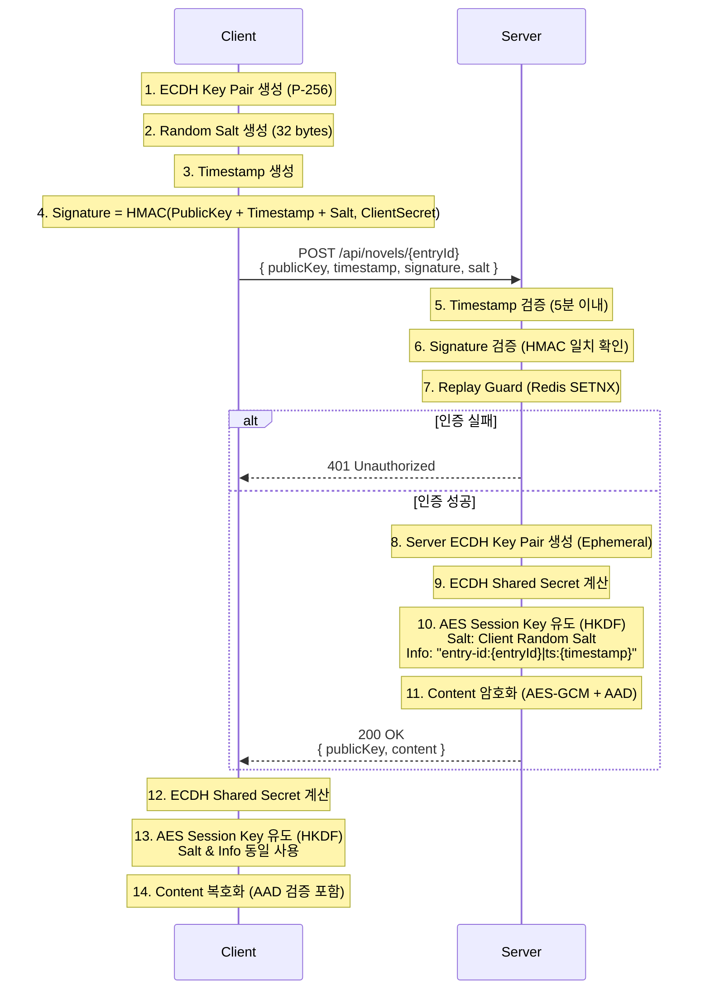

# 암호화 명세서 (v4 - ECDH + Client Auth)

## 프로토콜 개요
**ECDH (P-256)** 키 교환에 **HMAC-SHA256 서명**을 추가하여 클라이언트 인증을 수행합니다.

### POST를 사용하는 이유 (Why POST instead of GET?)
콘텐츠를 "조회"하는 API이지만, **GET이 아닌 POST**를 사용합니다. 이는 REST 의미론보다 **보안**을 우선한 설계입니다.

| 항목 | GET (Query Parameter) | POST (Request Body) |
| :--- | :--- | :--- |
| **민감 정보 노출** | ⚠️ URL에 공개키·서명이 포함되어 서버 로그, 브라우저 히스토리, CDN 로그, Referer 헤더에 기록됨 | ✅ Body는 로그에 기록되지 않음 |
| **URL 길이 제한** | ⚠️ ECDH 공개키(~180자) + 서명 + Salt로 URL이 수백 자 이상이 됨. 일부 프록시/CDN에서 잘릴 수 있음 | ✅ Body 크기 제한 없음 |
| **URL 인코딩** | ⚠️ Base64의 `+`, `/`, `=` 문자가 URL 인코딩 필요 (`%2B`, `%2F`, `%3D`). 인코딩/디코딩 오류 위험 | ✅ JSON으로 전송하므로 인코딩 이슈 없음 |
| **캐싱** | ⚠️ 브라우저/CDN이 자동 캐싱할 수 있음. 매번 새로운 ECDH 키 쌍이 필요한 구조와 충돌 | ✅ 캐싱되지 않음 |
| **북마크/공유** | ⚠️ 인증 정보가 포함된 URL이 북마크·공유될 위험 | ✅ 불가능 |

> **핵심**: 이 API는 단순 조회가 아니라 **ECDH 키 교환 + HMAC 인증 + 암호화**를 동시에 수행하는 **보안 프로토콜 엔드포인트**이므로, POST가 적합합니다.

### 1. 키 교환 핸드셰이크 (Key Exchange Handshake)
1.  **Client (클라이언트)**:
    *   ECDH 키 쌍 생성 (`Client Public Key`).
    *   **Random Salt 생성**: 32 bytes 난수 (Base64).
    *   현재 시간 `timestamp` (Unix Epoch Milliseconds) 생성.
    *   **서명 생성**: `Signature` = HMAC-SHA256(`Client Public Key` + `timestamp` + `Salt`, `HMAC_SECRET`).
    *   전송: `{ publicKey, timestamp, signature, salt }`

2.  **Server (서버)**:
    *   **타임스탬프 검증**: `Current Time` - `timestamp` < 5분 (Replay Attack 방지).
    *   **서명 검증**: 클라이언트가 보낸 `salt`를 포함하여 HMAC 재계산 및 비교 (Salt Integrity).
    *   **Replay 방어**: Redis SETNX로 동일 (publicKey, timestamp, salt) 조합 재사용 차단.
    *   검증 성공 시 ECDH 수행.
    *   응답: `{ publicKey, content }`

### 흐름도 (Sequence Diagram)


## 2. 상세 암호화/복호화 프로세스 (Detailed Cryptographic Process)

### 클라이언트 준비 (Client → Server 요청 전)

#### Step 1: ECDH 키 쌍 생성 (Key Generation)
*   **알고리즘**: Elliptic Curve Diffie-Hellman (ECDH)
*   **Curve**: `secp256r1` (NIST P-256)
*   **Public Key Format**: X.509 `SubjectPublicKeyInfo` (SPKI, DER 인코딩, 91 bytes)
    *   **iOS (CryptoKit)**: `derRepresentation` 프로퍼티가 SPKI(91 bytes)를 반환함을 확인. `x963Representation`(65 bytes)이나 `rawRepresentation`(64 bytes)과는 다른 포맷.
*   **Private Key Format**: PKCS#8

#### Step 2: Random Salt 생성
*   **크기**: 32 bytes
*   **생성**: `SecureRandom` (Java/Android), `CryptoKit` (iOS), `crypto.getRandomValues()` (Web)
*   **용도**: HKDF의 Salt 파라미터로 사용 (매 요청마다 고유)

#### Step 3: Timestamp 생성
*   **값**: `System.currentTimeMillis()` (Unix Epoch Milliseconds)
*   **용도**: Replay Attack 방지 (서버에서 5분 이내인지 검증), HKDF Info에 포함하여 Context Binding

#### Step 4: 클라이언트 인증 서명 생성 (Client Authentication)
*   **Algorithm**: `HMAC-SHA256`
*   **Secret**: `HMAC_SECRET` ("auth-secret-1234")
*   **Data to Sign**: `ClientPublicKey(Base64)` + `Timestamp(Long as String)` + `Salt(Base64)`
*   **출력**: `Signature` (Base64)

---

### 클라이언트 → 서버 요청 (HTTP Request)

*   **Method**: `POST`
*   **Endpoint**: `/api/novels/{entryId}`
*   **Content-Type**: `application/json`
*   **Request Body**:
    ```json
    {
      "publicKey": "Base64(Client ECDH Public Key)",
      "timestamp": 1707600000000,
      "signature": "Base64(HMAC-SHA256)",
      "salt": "Base64(Random 32 bytes)"
    }
    ```

---

### 서버 검증 및 암호화 (Server 측 처리)

#### Step 5~7: 요청 검증 (Validation)
| Step | 검증 항목 | 설명 |
| :--- | :--- | :--- |
| 5 | **Timestamp 검증** | `|현재시간 - timestamp| < 5분` (절대값 비교, 미래 시간도 차단) |
| 6 | **Signature 검증** | HMAC 재계산 후 `MessageDigest.isEqual()` 비교 (Timing Attack 방지) |
| 7 | **Replay Guard** | Nonce(`publicKey + timestamp + salt`)를 **SHA-256 해시** 후 Redis `SETNX`로 재사용 차단 (TTL: 5분) |

#### Step 8: 서버 ECDH 키 쌍 생성 (Ephemeral Key Generation)
*   클라이언트와 동일한 P-256 커브로 **매 요청마다 새로운 임시(Ephemeral) 키 쌍**을 생성합니다.
*   **Forward Secrecy**: 요청마다 키가 달라져, 하나의 키가 노출되어도 다른 세션에 영향 없음.

#### Step 9: 공유 비밀 계산 (Shared Secret Calculation)
*   **작업**: ECDH Key Agreement
*   **실행**: `Server Private Key` + `Client Public Key` → `Shared Secret` (32 bytes)
*   **특징**: 공유 비밀 자체는 **절대 네트워크로 전송되지 않습니다.**

#### Step 10: 세션 키 유도 (Key Derivation - HKDF)
공유 비밀을 그대로 암호화 키로 사용하지 않고, **HKDF (HMAC-based Key Derivation Function, [RFC 5869](https://tools.ietf.org/html/rfc5869))** 를 통해 안전한 세션 키를 유도합니다.
*   **Algorithm**: `HKDF-SHA256` (Extract-then-Expand)
    *   **Extract**: `PRK = HMAC-SHA256(Salt, Shared Secret)`
    *   **Expand**: `OKM = HMAC-SHA256(PRK, Info || 0x01)` → 앞 32 bytes 사용
*   **Salt**: Step 2에서 클라이언트가 생성한 Random 32 bytes
*   **Info**: `"entry-id:{entryId}|ts:{timestamp}"` (Context Binding, UTF-8 bytes)
    *   `{entryId}`: 요청된 소설 챕터 ID
    *   `{timestamp}`: 클라이언트가 생성한 타임스탬프 (Unix Epoch Milliseconds)
*   **Output**: 32 bytes (256 bits) → **AES Session Key**
*   **플랫폼별 구현체**: Backend(수동 구현), Android(Google Tink), Web(Web Crypto API), Wasm(hkdf crate), iOS(CryptoKit HKDF)

#### Step 11: 콘텐츠 암호화 (Data Encryption - AES-GCM)
*   **Algorithm**: `AES/GCM/NoPadding`
*   **Key**: Step 10에서 유도된 `Session Key` (32 bytes)
*   **IV (Initialization Vector)**: 매 요청마다 생성되는 Random 12 bytes
*   **Tag Length**: 128 bits
*   **AAD (Additional Authenticated Data)**: `"entry-id:{entryId}|ts:{timestamp}"` (Context Binding)
    *   Info 문자열과 동일한 값을 AAD로 사용하여 암호문에 컨텍스트를 바인딩합니다.
*   **출력 포맷**: `Base64(IV + Ciphertext + Tag)`
    *   앞 12바이트: IV
    *   나머지: 암호문 + 인증 태그(Tag는 자동으로 붙음)

---

### 클라이언트 복호화 (Client 측 응답 처리)

#### Step 12: 공유 비밀 계산
*   **실행**: `Client Private Key` + `Server Public Key` → `Shared Secret` (32 bytes)
*   서버와 **동일한** 공유 비밀이 독립적으로 계산됩니다.

#### Step 13: 세션 키 유도 (HKDF)
*   Step 10과 **동일한** Salt, Info를 사용하여 같은 Session Key를 유도합니다.

#### Step 14: 콘텐츠 복호화 (AES-GCM Decryption)
*   Step 11과 동일한 AAD를 사용하여 복호화 및 무결성 검증을 수행합니다.
*   AAD 불일치 시 복호화 실패 → Context Binding 보장

## 3. 스트리밍 API (SSE - Server-Sent Events)

대용량 콘텐츠를 Chunk 단위로 암호화하여 실시간 스트리밍합니다.

*   **Endpoint**: `POST /api/novels/{entryId}/stream?chunkSize=100`
*   **인증**: REST API와 동일 (HMAC + Timestamp + Replay Guard)
*   **이벤트 흐름**:
    1.  `init` — `{ publicKey, totalChunks }` (서버 공개키 + 총 청크 수)
    2.  `chunk` — `{ index, content }` (암호화된 텍스트 조각, 각각 독립 IV)
    3.  `done` — `{ totalChunks }` (스트림 종료 신호)
*   **각 Chunk는 동일한 Session Key + 독립된 IV로 암호화됩니다.**

## 참고 정보 (Demo)
*   **HMAC_SECRET**: `auth-secret-1234`
*   **REST API**: `POST http://localhost:8080/api/novels/1`
*   **Streaming API**: `POST http://localhost:8080/api/novels/1/stream?chunkSize=100`
